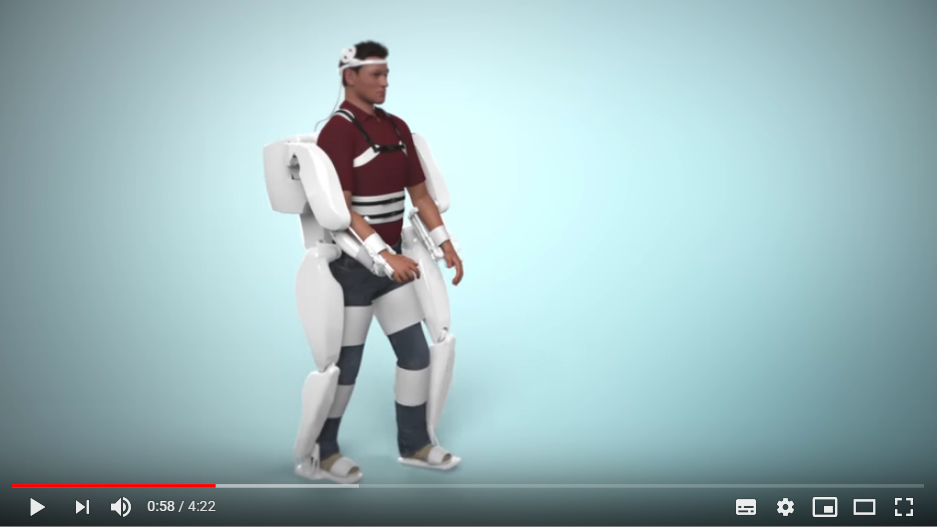

# INFORMATIONS SUR LA MOBILITÉ DES PERSONNES HANDICAPÉES  
[ACCUEIL](index.md)
## INTRODUCTION  

## ESPACES POUR HANDICAPÉS DANS LES SALONS DES NOUVELLES TECHNOLOGIES 
* [Le CES à Las Vegas](ces.md)
* [Le salon Handica](handica.md)
   
## LES DIFFÉRENTES TECHNOLOGIES
##### 1. Les exosquelettes 
- [Informations globales](exoprésent.md)
- **_Projet BCI_**
  
##### 2. Les prothèses
- [Informations globales](Prothèseinfo.md)
- [Prothèses 3D](Prothèse3D.md)
- [Hugh Herr : Conférences (Anglais)](Hughvidéo.md)
  
##### 3. Les fauteuils roulants
- [Fauteuils verticalisateurs](FauteuilVertical.md)
- ["NEUROMOOV"](Neuromoov.md)
  
##### 4. La canne connectée
- ["SHERPA"](Canneconnectée.md)
  
##### 5. Véhicules pour handicapés
- [Voitures adaptées](Voitureadaptée.md)
- [Voiture "ELBEE"](Elbee.md)

----------------------------------------------------------
 
Le project "BCI" consiste en un exosquelette controlé par la pensée. Il s'agirait de piloter grâce aux signaux du cerveau qui seraient captés par des récepteur de la machine, ce qui ferait bouger l'exosquelette. 
Cela permettrait de rendre une grande mobilité aux personnes handicapées.

   

### CLINATEC. « Demain, faire remarcher les tétraplégiques » [en ligne]. _Centre de recherche biomédicale Edmond J.Safra_. Mise à jour le 27 octobre 2018 [Consulté le 20 mai 2019]. Disponible en ligne : [http://www.clinatec.fr/challenges/faire-remarcher-les-tetraplegiques/](http://www.clinatec.fr/challenges/faire-remarcher-les-tetraplegiques/)

   

### CLINATEC. « Le projet "BCI" » [en ligne]. _Clinatec._ Mis à jour le 27 octobre 2018 [Consulté le 30 mai 2019]. Disponible en ligne : [https://www.clinatec.fr/recherche/nos-projets/le-projet-bci/](https://www.clinatec.fr/recherche/nos-projets/le-projet-bci/)

   

### FONDS DE DOTATION CLINATEC. « Le projet "BCI" » [en ligne]. _Youtube._ Publié le 12 avril 2016 [Consulté le 25 mai 2019]. 4 min 22 sec. Disponible en ligne : [https://www.youtube.com/watch?time_continue=123&v=bzANaU8FUC8](https://www.youtube.com/watch?time_continue=123&v=bzANaU8FUC8)
 
