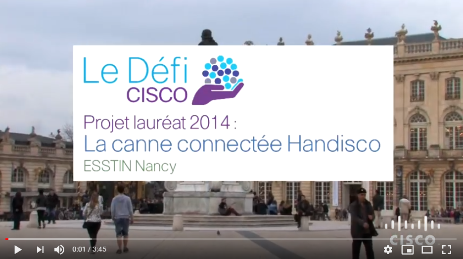
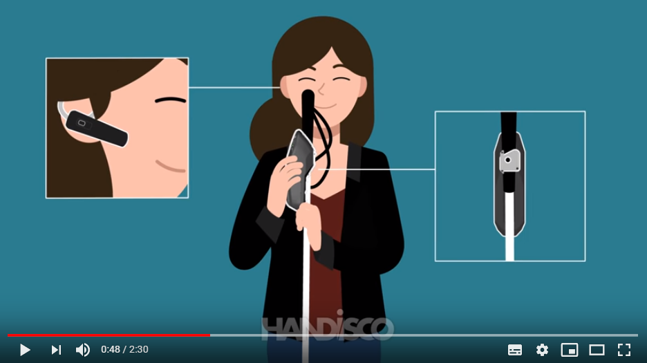
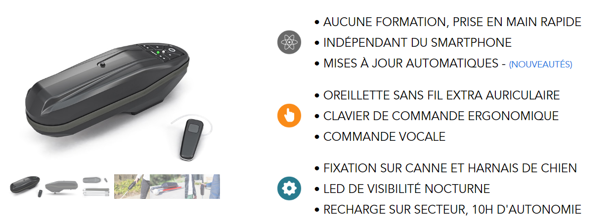
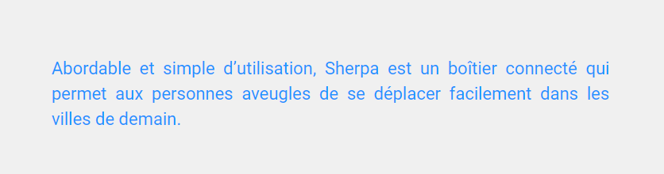

# INFORMATIONS SUR LA MOBILITÉ DES PERSONNES ATTEINTES DE HANDICAP
[ACCUEIL](index.md)
## INTRODUCTION  

## ESPACES POUR PORTEUR DE HANDICAP DANS LES SALONS DES NOUVELLES TECHNOLOGIES 
* [Le CES à Las Vegas](ces.md)
* [Le salon Handica](handica.md)
   
## LES DIFFÉRENTES TECHNOLOGIES
##### 1. Les exosquelettes 
- [Informations globales](exoprésent.md)
- [Projet "BCI"](BCI.md)
  
##### 2. Les prothèses
- [Informations globales](Prothèseinfo.md)
- [Prothèses 3D](Prothèse3D.md)
- [Hugh Herr : Conférences (Anglais)](Hughvidéo.md)
  
##### 3. Les fauteuils roulants
- [Fauteuils verticalisateurs](FauteuilVertical.md)
- ["NEUROMOOV"](Neuromoov.md)
  
##### 4. La canne connectée
- **_"SHERPA"_**
  
##### 5. Véhicules pour personne à mobilité réduite
- [Voitures adaptées](Voitureadaptée.md)
- [Voiture "ELBEE"](Elbee.md)

----------------------------------------------------------
 

Pour améliorer la mobilité des malvoyants et des aveugles, Handisco a développé "Sherpa". C'est un boîtier connecté qui est attaché à la canne et qui permet, grâce à un service de géolocalisation, de fournir un itinéraire précis à l'usager. 

 

### CISCOFRANCE. « La canne connectée Handisco, projet lauréat du Défi Cisco 2014 » [en ligne]. _YouTube._ Publié le 3 avril 2014 [Consulté le 24 mai 2019]. 3 min 45 sec. Disponible en ligne : [https://www.youtube.com/watch?time_continue=150&v=WRDjZeZAnn0](https://www.youtube.com/watch?time_continue=150&v=WRDjZeZAnn0)

   

### HANDISCO. « Sherpa, la 1ère canne blanche connectée pour déficients visuels ! Par Handisco » [en ligne]. _Youtube._ Publié le 26 octobre 2017 [Consulté le 20 mai 2019]. 2 min 30 sec. Disponible en ligne : [https://www.youtube.com/watch?v=PLMdzZrhl7A](https://www.youtube.com/watch?v=PLMdzZrhl7A)

   

### HANDISCO. « Sherpa par Handisco | La 1ère canne blanche connectée - Handisco »  [en ligne]. _Handisco._ Mise à jour le 1 avril 2019 [Consulté le 28 mai 2019]. Disponible en ligne : [https://handisco.com/](https://handisco.com/)

   

### HELLO OPEN WORLD (HOW). « Canne blanche connectée : la solution de Handisco pour les non-voyants » [en ligne]. _Hello Open World._ Mise à jour le 31 mai 2018 [Consulté le 20 mai 2019]. Disponible en ligne : [https://www.helloopenworld.com/grace-a-la-smart-city-les-personnes-malvoyantes-peuvent-se-deplacer-plus-facilement-6263](https://www.helloopenworld.com/grace-a-la-smart-city-les-personnes-malvoyantes-peuvent-se-deplacer-plus-facilement-6263)

