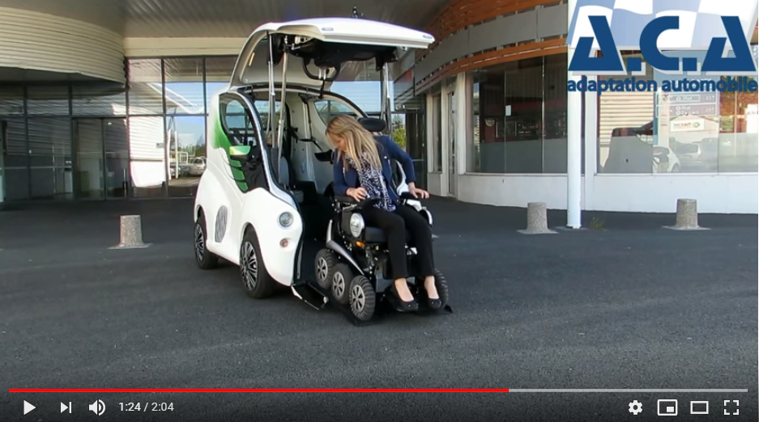
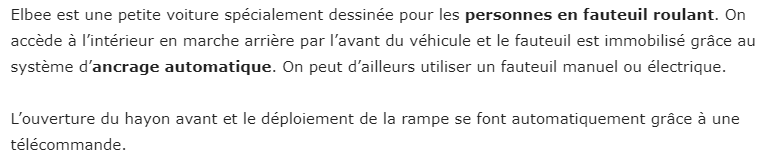

# INFORMATIONS SUR LA MOBILITÉ DES PERSONNES ATTEINTES DE HANDICAP
[ACCUEIL](index.md)
## INTRODUCTION  

## ESPACES POUR PORTEUR DE HANDICAP DANS LES SALONS DES NOUVELLES TECHNOLOGIES 
* [Le CES à Las Vegas](ces.md)
* [Le salon Handica](handica.md)
   
## LES DIFFÉRENTES TECHNOLOGIES
##### 1. Les exosquelettes 
- [Informations globales](exoprésent.md) 
- [Projet "BCI"](BCI.md)
  
##### 2. Les prothèses
- [Informations globales](Prothèseinfo.md)
- [Prothèses 3D](Prothèse3D.md)
- [Hugh Herr : Conférences (Anglais)](Hughvidéo.md)
  
##### 3. Les fauteuils roulants
- [Fauteuils verticalisateurs](FauteuilVertical.md)
- ["NEUROMOOV"](Neuromoov.md)
  
##### 4. La canne connectée
- ["SHERPA"](Canneconnectée.md)
  
##### 5. Véhicules pour personne à mobilité réduite
- [Voitures adaptées](Voitureadaptée.md)
- **_Voiture "ELBEE"_**

----------------------------------------------------------
 

"ElBEE" est une petite voiture à moteur thermique accessible et conçue pour les personnes en fauteuil roulant.
Cela facilite grandement la mobilité des personnes portant un handicap et cela démontre les grandes possiblilitées d'innovations technologiques que nous pouvons concevoir.

 

### A.C.A FRANCE. « Elbee - Conduite en Fauteuil roulant » [en ligne]. _Youtube_ Publié le 22 juin 2015 [Consulté le 25 mai 2019]. 2 min 04 sec. Disponible sur le Web : [https://www.youtube.com/watch?time_continue=33&v=_KpmY4FoPRw](https://www.youtube.com/watch?time_continue=33&v=_KpmY4FoPRw) 

   

### ELBEE. « Elbee #Your freedom of movement » [en ligne]. _Accueil._ Mise à jour le 7 mai 2016 [Consulté le 25 mai 2019]. Disponible sur le Web : [https://www.elbeemobility.com/](https://www.elbeemobility.com/)

> Site en anglais

   

### LE BLOG EMPLOI HANDICAP. « Elbee, la voiture qui rend indépendant les personnes en fauteuil » [en ligne]. _Accueil._ Publié le 29 décembre 2016 [Consulté le 25 mai 2019]. sur le Web : [https://www.handicap-job.com/blog/2016/12/29/elbee-voiture-rend-independant-personnes-fauteuil/](https://www.handicap-job.com/blog/2016/12/29/elbee-voiture-rend-independant-personnes-fauteuil/)

