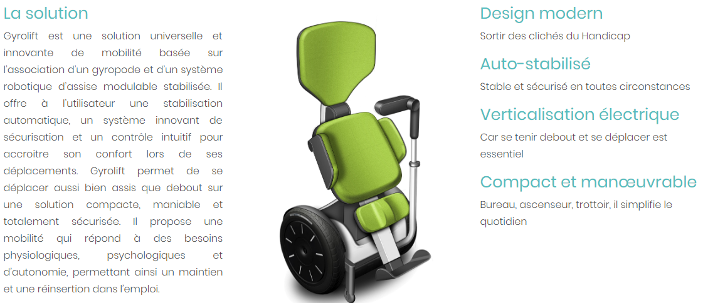

# INFORMATIONS SUR LA MOBILITÉ DES PERSONNES HANDICAPÉES  
[ACCUEIL](index.md)
## INTRODUCTION  

## ESPACES POUR HANDICAPÉS DANS LES SALONS DES NOUVELLES TECHNOLOGIES 
* [Le CES à Las Vegas](ces.md)
* [Le salon Handica](handica.md)
   
## LES DIFFÉRENTES TECHNOLOGIES
##### 1. Les exosquelettes 
- [Informations globales](exoprésent.md)
- [Projet "BCI"](BCI.md)
  
##### 2. Les prothèses
- [Informations globales](Prothèseinfo.md)
- [Prothèses 3D](Prothèse3D.md)
- [Hugh Herr : Conférences (Anglais)](Hughvidéo.md)
  
##### 3. Les fauteuils roulants
- **_Fauteuils verticalisateurs_**
- ["NEUROMOOV"](Neuromoov.md)
  
##### 4. La canne connectée
- ["SHERPA"](Canneconnectée.md)
  
##### 5. Véhicules pour handicapés
- [Voitures adaptées](Voitureadaptée.md)
- [Voiture "ELBEE"](Elbee.md)

----------------------------------------------------------
 

Les fauteuils roulants sont une des bases de la mobilité et de l'autonomie chez les handicapés. Les différentes innovations technologiques font évoluer ces moyen de déplacement. Les fauteuils verticalisateurs permettent de se déplacer en restant debout, ce changement de position apporte un éventail de possibilités innacessible pour un fauteuil roulant classique. 

 

### GYROLIFT. « Gyrolift » [en ligne].  _Gyrolift New mobility solution._ Mise à jour le 22 novembre 2018 [Consulté le 29 mai 2019]. Disponible en ligne : [http://www.gyrolift.fr/#section-partenaires](http://www.gyrolift.fr/#section-partenaires)

   

### GYROLIFT. « Gyrolift, fauteuil roulant verticalisateur » [en ligne]. _Youtube._ Publié le 15 juin 2015 [Consulté le 29 mai 2019]. Disponible en ligne : [https://www.youtube.com/watch?v=3dnNYjydDR8](https://www.youtube.com/watch?v=3dnNYjydDR8)

   

### SUNRISE MEDICAL. « Fauteuil verticalisateur QUICKIE Q700-UP M »   [en ligne]. _Sunrise Medical._ Mise à jour le 5 mai 2019 [Consulté le 29 mai 2019]. Disponible en ligne : [https://www.sunrisemedical.fr/fauteuils-roulants/quickie/fauteuil-roulant-verticalisateur-q700-up-m](https://www.sunrisemedical.fr/fauteuils-roulants/quickie/fauteuil-roulant-verticalisateur-q700-up-m)

