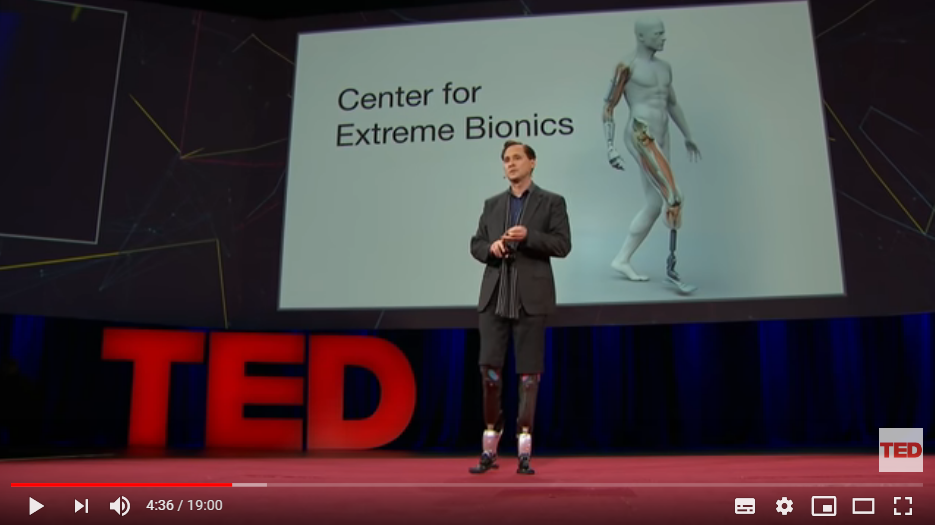
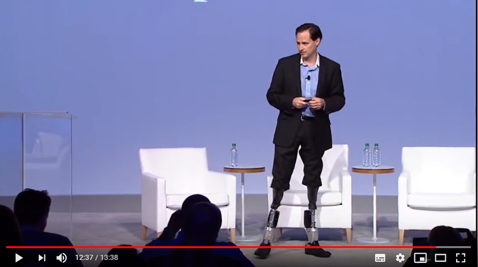

# INFORMATIONS SUR LA MOBILITÉ DES PERSONNES ATTEINTES DE HANDICAP
[ACCUEIL](index.md)
## INTRODUCTION  

## ESPACES POUR PORTEUR DE HANDICAP DANS LES SALONS DES NOUVELLES TECHNOLOGIES 
* [Le CES à Las Vegas](ces.md)
* [Le salon Handica](handica.md)
   
## LES DIFFÉRENTES TECHNOLOGIES
##### 1. Les exosquelettes  
- [Informations globales](exoprésent.md)
- [Projet "BCI"](BCI.md)
  
##### 2. Les prothèses
- [Informations globales](Prothèseinfo.md)
- [Prothèses 3D](Prothèse3D.md)
- **_Hugh Herr : Conférences (Anglais)_**
  
##### 3. Les fauteuils roulants
- [Fauteuils verticalisateurs](FauteuilVertical.md)
- ["NEUROMOOV"](Neuromoov.md)
  
##### 4. La canne connectée
- ["SHERPA"](Canneconnectée.md)
  
##### 5. Véhicules pour personne à mobilité réduite
- [Voitures adaptées](Voitureadaptée.md)
- [Voiture "ELBEE"](Elbee.md)

----------------------------------------------------------
 

Hugh Herr est une personne avec un handicap moteur ayant perdu ses deux jambes dans un accident.
Aujourd'hui, il est responsable du groupe Biomécatronique du Media Lab du MIT. Il donne parfois des conférences et des représentations pour y présenter ses nouvelles innovations technologiques.

 

### TED. « Hugh Herr: La nouvelle bionique pour courir, escalader et danser » [en ligne]. Publié le 28 mars 2014 [Consulté le 24 mai 2019]. 19 min 00 sec. Disponible sur le Web : [https://youtu.be/CDsNZJTWw0w](https://youtu.be/CDsNZJTWw0w)

> Vidéo en anglais

   

### ZeitgeistMinds. « The World We Dream- Hugh Herr Zeitgeist Americas 2012 » [en ligne]. Publié le 16 octobre [Consulté le 24 mai 2019]. 13 min 38 sec. Disponible sur le Web : [https://youtu.be/it1A4qT1cHs](https://youtu.be/it1A4qT1cHs)

> Vidéo en anglais
