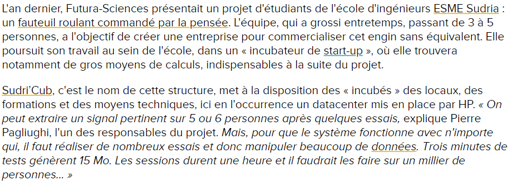
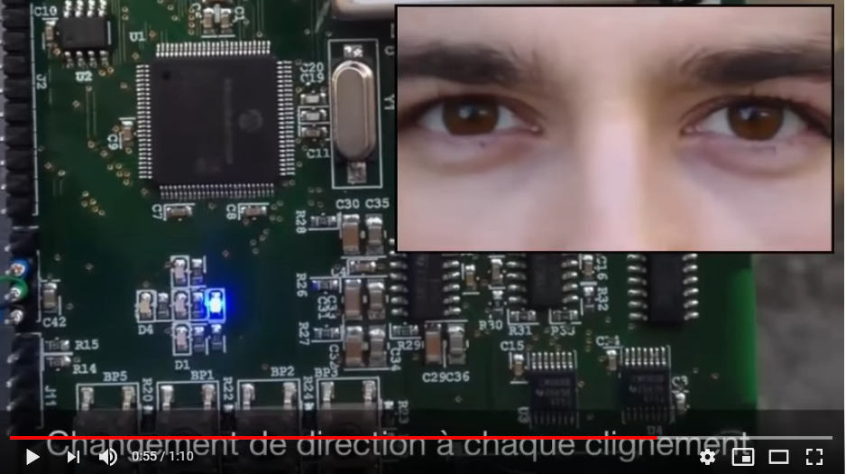

# INFORMATIONS SUR LA MOBILITÉ DES PERSONNES ATTEINTES DE HANDICAP
[ACCUEIL](index.md)
## INTRODUCTION  

## ESPACES POUR PORTEUR DE HANDICAP DANS LES SALONS DES NOUVELLES TECHNOLOGIES 
* [Le CES à Las Vegas](ces.md)
* [Le salon Handica](handica.md)
   
## LES DIFFÉRENTES TECHNOLOGIES
##### 1. Les exosquelettes 
- [Informations globales](exoprésent.md)
- [Projet "BCI"](BCI.md)
  
##### 2. Les prothèses
- [Informations globales](Prothèseinfo.md)
- [Prothèses 3D](Prothèse3D.md)
- [Hugh Herr : Conférences (Anglais)](Hughvidéo.md)
  
##### 3. Les fauteuils roulants
- [Fauteuils verticalisateurs](FauteuilVertical.md)
- **_"NEUROMOOV"_**
  
##### 4. La canne connectée
- ["SHERPA"](Canneconnectée.md)
  
##### 5. Véhicules pour personne à mobilité réduite
- [Voitures adaptées](Voitureadaptée.md)
- [Voiture "ELBEE"](Elbee.md)

----------------------------------------------------------

 

L'innovation "NEUROMOOV" consiste en un fauteuil roulant classique mais dont la particuliarité est de pouvoir fonctionner grâce aux ondes cérébrales. Le casque, posé sur la tête, analyse le cerveau et traduit les ondes en commandes pour faire bouger le fauteuil. L'idée vient d'ingénieurs de l'école ESME sudria.

 

### GOUDET, Jean-Luc. « Neuromoov, le fauteuil roulant commandé par la pensée » [en ligne]. _Futura Tech._ Publié le 20 novembre 2015. [Consulté le 24 mai 2019]. Disponible sur le Web : [https://www.futura-sciences.com/tech/actualites/technologie-neuromoov-fauteuil-roulant-commande-pensee-60492/](https://www.futura-sciences.com/tech/actualites/technologie-neuromoov-fauteuil-roulant-commande-pensee-60492/)

   

### TROPHÉES DES INGÉNIEURS DE DEMAIN. « Pierre PAGLIUGHI - NEUROMOOV » [en ligne]. _Youtube_ Publié le 10 novembre 2015 [Consulté le 24 mai 2019]. 1 min 10 sec. Disponible sur le Web : [https://www.youtube.com/watch?time_continue=2&v=rZfwK83qj88](https://www.youtube.com/watch?time_continue=2&v=rZfwK83qj88)

