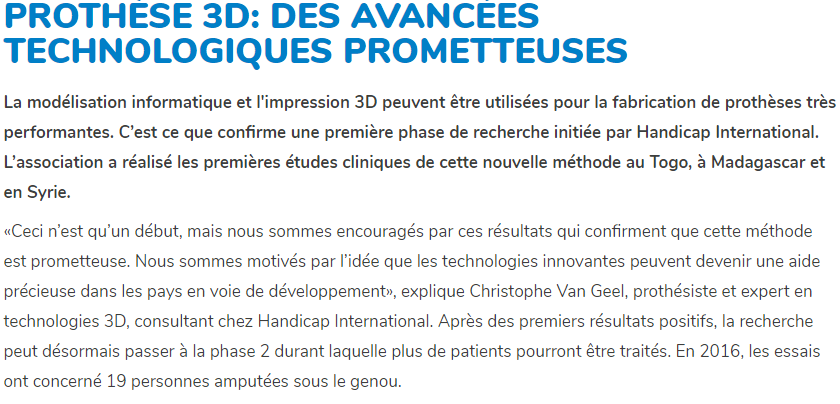
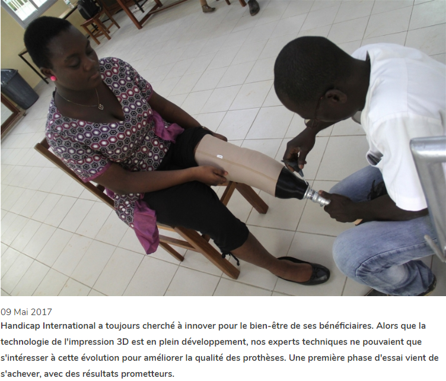

# INFORMATIONS SUR LA MOBILITÉ DES PERSONNES HANDICAPÉES  
[ACCUEIL](index.md)
## INTRODUCTION  

## ESPACES POUR HANDICAPÉS DANS LES SALONS DES NOUVELLES TECHNOLOGIES 
* [Le CES à Las Vegas](ces.md)
* [Le salon Handica](handica.md)
   
## LES DIFFÉRENTES TECHNOLOGIES
##### 1. Les exosquelettes 
- [Informations globales](exoprésent.md)
- [Projet "BCI"](BCI.md)
  
##### 2. Les prothèses
- [Informations globales](Prothèseinfo.md)
- **_Prothèses 3D_**
- [Hugh Herr : Conférences (Anglais)](Hughvidéo.md)
  
##### 3. Les fauteuils roulants
- [Fauteuils verticalisateurs](FauteuilVertical.md)
- ["NEUROMOOV"](Neuromoov.md)
  
##### 4. La canne connectée
- ["SHERPA"](Canneconnectée.md)
  
##### 5. Véhicules pour handicapés
- [Voitures adaptées](Voitureadaptée.md)
- [Voiture "ELBEE"](Elbee.md)

----------------------------------------------------------
 

Grâce à la technologie 3D, l'avancée technologique des prothèses peut être partagée avec des pays dans le besoin n'ayant pas les ressources nécessaires pour s'en procurer.
Désormais, les scanner 3D font des moules numériques du membre voulu et envoient l'analyse aux imprimantes 3D pour créer de nouvelles prothèses.

 

### VANDERHEYDE, Diana. « Prothèse 3D: Des avancées technologiques prometteuses » [en ligne]. _Handicap International._ Mise à jour le 15 mai 2017 [Consulté le 20 mai 2019]. Disponible en ligne : [https://www.handicapinternational.be/fr/presse/prothese-3d-des-avancees-technologiques-prometteuses](https://www.handicapinternational.be/fr/presse/prothese-3d-des-avancees-technologiques-prometteuses)

   

### HANDICAP INTERNATIONAL. « Prothèse 3D : des avancées technologiques prometteuses ».  [en ligne]. _Handicap International._ Publié le 9 mai 2017 [Consulté le 20 mai 2019]. Disponible en ligne : [https://www.handicapinternational.be/fr/actualites/prothese-3d-des-avancees-technologiques-prometteuses](https://www.handicapinternational.be/fr/actualites/prothese-3d-des-avancees-technologiques-prometteuses)

