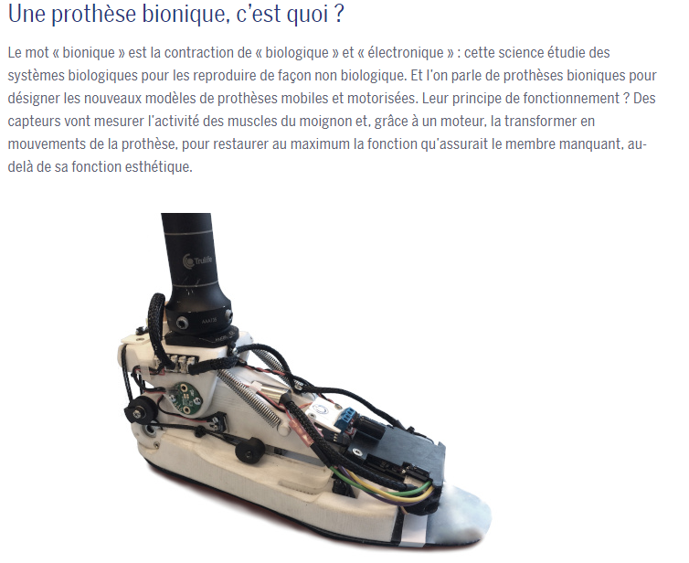
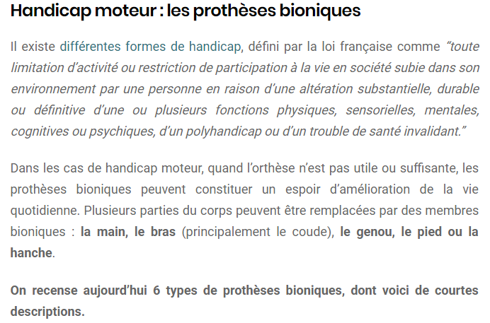
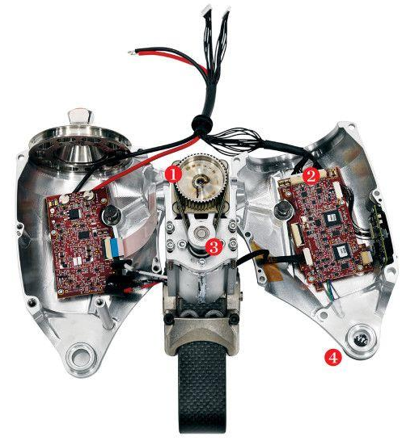

# INFORMATIONS SUR LA MOBILITÉ DES PERSONNES ATTEINTES DE HANDICAP
[ACCUEIL](index.md)
## INTRODUCTION  

## ESPACES POUR PORTEUR DE HANDICAP DANS LES SALONS DES NOUVELLES TECHNOLOGIES 
* [Le CES à Las Vegas](ces.md)
* [Le salon Handica](handica.md)
   
## LES DIFFÉRENTES TECHNOLOGIES
##### 1. Les exosquelettes 
- [Informations globales](exoprésent.md)
- [Projet "BCI"](BCI.md)
  
##### 2. Les prothèses
- **_Informations globales_**
- [Prothèses 3D](Prothèse3D.md)
- [Hugh Herr : Conférences (Anglais)](Hughvidéo.md)
  
##### 3. Les fauteuils roulants
- [Fauteuils verticalisateurs](FauteuilVertical.md)
- ["NEUROMOOV"](Neuromoov.md)
  
##### 4. La canne connectée
- ["SHERPA"](Canneconnectée.md)
  
##### 5. Véhicules pour personne à mobilité réduite
- [Voitures adaptées](Voitureadaptée.md)
- [Voiture "ELBEE"](Elbee.md)

----------------------------------------------------------
 

L'évolution des prothèses de nos jours est fulgurante. Grâce à la technologie, nous sommes capable d'inventer et de concevoir des prothèses bioniques afin d'améliorer la mobilité des personnes portant un hadicap. Elles peuvent désormais propulser, freiner, analyser et communiquer un maximum d'informations

 

### PARTENAMUT. « Prothèses bioniques : du hightec pour les bras et les jambes » [en ligne]. _Partenamut Mutualité Libre._ Mise à jour le 24 février 2019 [Consulté le 24 mai 2019]. Disponible sur le Web : [https://www.partenamut.be/fr/blog-sante-et-bien-etre/articles/protheses-bioniques](https://www.partenamut.be/fr/blog-sante-et-bien-etre/articles/protheses-bioniques)

   

### SCIENCEPOST. « Quelles sont les dernières innovations technologiques au service du handicap ? » [en ligne]. _Sciencepost._ Publié le 31 août 2018 [Consulté le 25 mai 2019]. Disponible sur le Web : [https://sciencepost.fr/2018/08/les-dernieres-innovations-technologiques-au-service-du-handicap/](https://sciencepost.fr/2018/08/les-dernieres-innovations-technologiques-au-service-du-handicap/)

   

### TECHNOLOGIE ET INNOVATION DU PRÉSENT ET DU FUTUR. « BiOM : Prothèse bionique pour remplacer une jambe amputée » [en ligne]. _Technologie et innovation du présent et du futur._ Mise à jour le 17 août 2019 [Consulté le 24 mai 2019]. Disponible sur le Web : [https://technologie-innovation.fr/biom-prothese-bionique-pour-remplacer-une-jambe-amputee](https://technologie-innovation.fr/biom-prothese-bionique-pour-remplacer-une-jambe-amputee)

