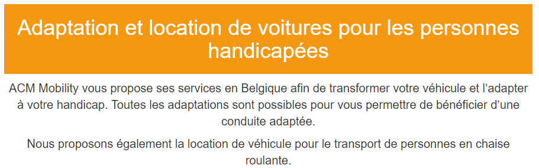
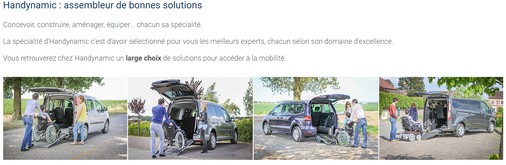

# INFORMATIONS SUR LA MOBILITÉ DES PERSONNES HANDICAPÉES  
[ACCUEIL](index.md)
## INTRODUCTION  

## ESPACES POUR HANDICAPÉS DANS LES SALONS DES NOUVELLES TECHNOLOGIES 
* [Le CES à Las Vegas](ces.md)
* [Le salon Handica](handica.md)
   
## LES DIFFÉRENTES TECHNOLOGIES
##### 1. Les exosquelettes 
- [Informations globales](exoprésent.md)
- [Projet "BCI"](BCI.md)
   
##### 2. Les prothèses
- [Informations globales](Prothèseinfo.md)
- [Prothèses 3D](Prothèse3D.md)
- [Hugh Herr : Conférences (Anglais)](Hughvidéo.md)
  
##### 3. Les fauteuils roulants
- [Fauteuils verticalisateurs](FauteuilVertical.md)
- ["NEUROMOOV"](Neuromoov.md)
  
##### 4. La canne connectée
- ["SHERPA"](Canneconnectée.md)
  
##### 5. Véhicules pour handicapés
- **_Voitures adaptées_**
- [Voiture "ELBEE"](Elbee.md)

----------------------------------------------------------
 

Grâce aux innovations robotiques et numériques, il est désormais possible d'adapter sa voiture afin d'aider les personnes atteintes de handicap. Cela facilite grandement leurs transports et leurs déplacements.

 

### ACM MOBILITY CAR. « Adaptation de voiture et véhicule pour personnes handicapées en Belgique » [en ligne]. _ACM Mobility CAR._ Mise à jour le 26 janvier 2019 [Consulté le 28 mai 2019]. Disponible en ligne : [https://www.acmobility.com/fr/](https://www.acmobility.com/fr/)

   

### HANDYNAMIC. « Avec Handynamic, vous serez toujours en dynamique ! » [en ligne]. _handynamic. Véhicules accessibles._ Mise à jour le 31 mai 2017 [Consulté le 28 mai 2019]. Disponible en ligne : [https://www.handynamic.fr/voitures-pour-particuliers/](https://www.handynamic.fr/voitures-pour-particuliers/)

   

### HANDYNAMIC. « Handynamic, pour qui, pourquoi, comment ? » [en ligne]. _Youtube._ Publié le 12 janvier 2016 [Consulté le 28 mai 2019]. 2 min 38 sec. Disponible en ligne : [https://www.youtube.com/watch?time_continue=126&v=JgmXHvOQ5Vw](https://www.youtube.com/watch?time_continue=126&v=JgmXHvOQ5Vw)

