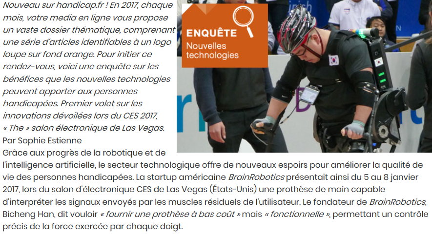

# INFORMATIONS SUR LA MOBILITÉ DES PERSONNES HANDICAPÉES  
[ACCUEIL](index.md) 
## INTRODUCTION

## ESPACES POUR HANDICAPÉS DANS LES SALONS DES NOUVELLES TECHNOLOGIES 
* **_Le CES à Las Vegas_**
* [Le salon Handica](handica.md) 
   
## LES DIFFÉRENTES TECHNOLOGIES
##### 1. Les exosquelettes 
- [Informations globales](exoprésent.md)
- [Projet "BCI"](BCI.md)
  
##### 2. Les prothèses
- [Informations globales](Prothèseinfo.md)
- [Prothèses 3D](Prothèse3D.md)
- [Hugh Herr : Conférences (Anglais)](Hughvidéo.md)
  
##### 3. Les fauteuils roulants
- [Fauteuils verticalisateurs](FauteuilVertical.md)
- ["NEUROMOOV"](Neuromoov.md)
  
##### 4. La canne connectée
- ["SHERPA"](Canneconnectée.md)
  
##### 5. Véhicules pour handicapés
- [Voitures adaptées](Voitureadaptée.md)
- [Voiture "ELBEE"](Elbee.md)

----------------------------------------------------------
 
Le CES est un salon se déroulant à Las Vegas qui est composé des nouvelles innovations électroniques, robotiques et d'intelligences artificielles. Parmis elles, un coin est réservé aux technologies pour les handicapés.

 

### AFP. Technologies du futur : le handicap est en marche ! [en ligne]._Handicap.fr_. Publié le 24 avril 2019. [Consulté le 20 mai 2019]. Disponible en ligne : [https://informations.handicap.fr/a-technologie-vegas-robots-9472.php](https://informations.handicap.fr/a-technologie-vegas-robots-9472.php)

 

