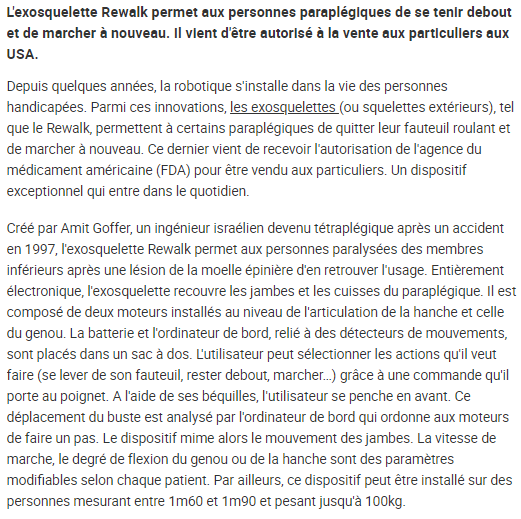
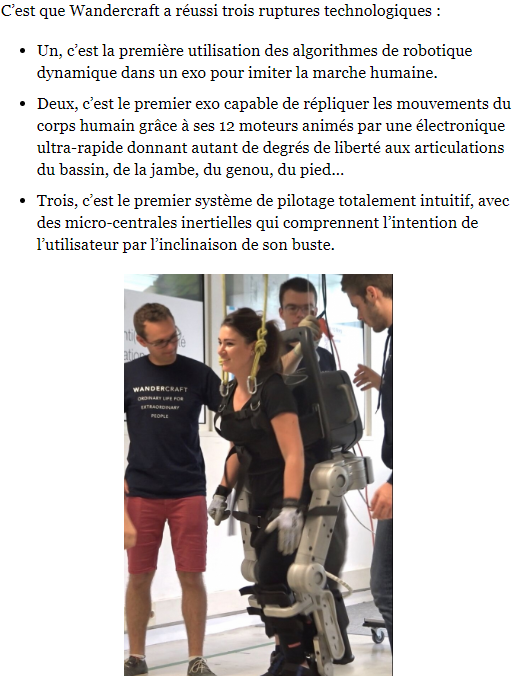
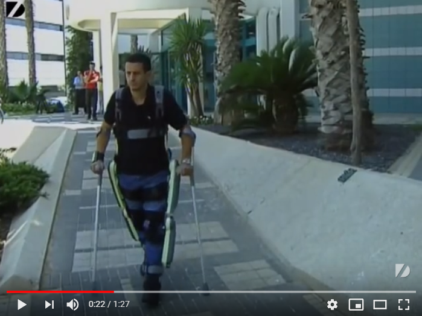

# INFORMATIONS SUR LA MOBILITÉ DES PERSONNES HANDICAPÉES  
[ACCUEIL](index.md)
## INTRODUCTION  
 
## ESPACES POUR HANDICAPÉS DANS LES SALONS DES NOUVELLES TECHNOLOGIES 
* [Le CES à Las Vegas](ces.md)
* [Le salon Handica](handica.md)
   
## LES DIFFÉRENTES TECHNOLOGIES
##### 1. Les exosquelettes 
- **_Informations globales_**
- [Projet "BCI"](BCI.md)
  
##### 2. Les prothèses
- [Informations globales](Prothèseinfo.md)
- [Prothèses 3D](Prothèse3D.md)
- [Hugh Herr : Conférences(Anglais)](Hughvidéo.md)
  
##### 3. Les fauteuils roulants
- [Fauteuils verticalisateurs](FauteuilVertical.md)
- ["NEUROMOOV"](Neuromoov.md)
  
##### 4. La canne connectée
- ["SHERPA"](Canneconnectée.md)
  
##### 5. Véhicules pour handicapés
- [Voitures adaptées](Voitureadaptée.md)
- [Voiture "ELBEE"](Elbee.md)

----------------------------------------------------------
 
Les exosquelettes sont une avancée technologique incroyable pour les personnes souffrant d'un handicap physique ou moteur.
Ce sont des ossatures robotiques articulées qui sont attachées au corps du patient.
Ils peuvent grâce à cette innovation, retrouver une mobolité et une autonomie qu'on n'aurait jamais cru possible il y a quelques années. 

 

### ANNE-LAURE LEBRUN. « les exosquelettes font leur entrée dans le quotidien » . [en ligne]. _Le figaro.fr_. 4 juillet 2017. [Consulté le 20 mai 2019]. Disponible sur le Web : [http://sante.lefigaro.fr/actualite/2014/07/04/22573-handicap-exosquelettes-font-leur-entree-dans-quotidien](http://sante.lefigaro.fr/actualite/2014/07/04/22573-handicap-exosquelettes-font-leur-entree-dans-quotidien)

   

### NORA,Dominique. « Un exosquelette permet aux paraplégiques de marche »  [en ligne]. _L'OBS_. Publié le 28 semptembre 2017 [Consulté le 20 mai 2019]. Disponible en ligne : [https://www.nouvelobs.com/economie/20170927.OBS5245/un-exosquelette-permet-aux-paraplegiques-de-marcher.html](https://www.nouvelobs.com/economie/20170927.OBS5245/un-exosquelette-permet-aux-paraplegiques-de-marcher.html)

   

### DIAGONAL VIEW.  « Exoskeleton Suit » . [en ligne]. _Youtube._ Publié le 31 mars 2010. [Consulté le 24 mai 2019]. 1 min 27 sec. Disponible en ligne : [https://www.youtube.com/watch?time_continue=48&v=XOm8yHuWlzsA](https://www.youtube.com/watch?time_continue=48&v=XOm8yHuWlzsA)

> Vidéo en Anglais

