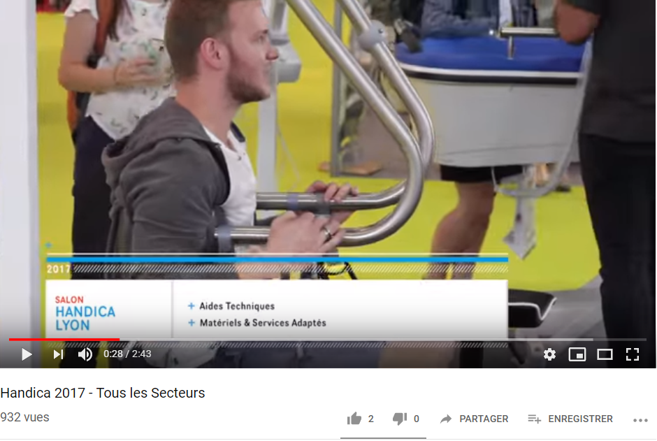

# INFORMATIONS SUR LA MOBILITÉ DES PERSONNES HANDICAPÉES

## [INTRODUCTION](index.md)

## ESPACES POUR HANDICAPÉS DANS LES SALONS DES NOUVELLES TECHNOLOGIES
* [Le CES à Las Vegas](ces.md)
* **_Le salon Handica_**

## LES TECNHNOLOGIES EXISTANTES

- [Les exosquelettes](exosquelette.md)
- [Les prothèses](prothèse.md)
- [Les fauteuils roulants](fauteuilroulant.md)
- [Les cannes connectées](canneconnectée.md)
- [Véhicules pour handicapés](véhicules.md) 

----------------------------------------------------------
Le salon Handica est un salon comprenant et exposant du matériel spécifique aux moyens de maintient à domicile et afin d'aider les personnes avec un handicap, les personnes agées et  différents .

#### SALON HANDICA. Le salon pour l’autonomie à tous les âges. [en ligne]. _In Salon Handica_. Publié le 21 février 2013. [Consulté le 25 mai 2019]. Disponible en ligne : http://www.handica.com/handica_lyon/lyon/fr/265-handica_lyon.html

 

#### SALON HANDICA. Handica 2017 [en ligne]. Publié le 13 juin 2017. [Consulté le 25 mai 2019]. Disponible en ligne : [https://www.youtube.com/watch?time_continue=3&v=LC8I_o1Zk4QMercredi](https://www.youtube.com/watch?time_continue=3&v=LC8I_o1Zk4Q) 

