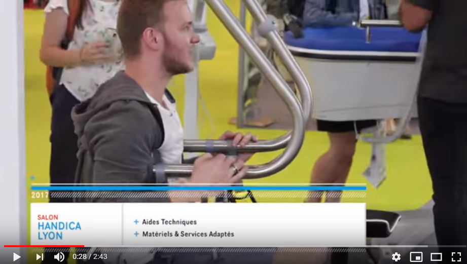
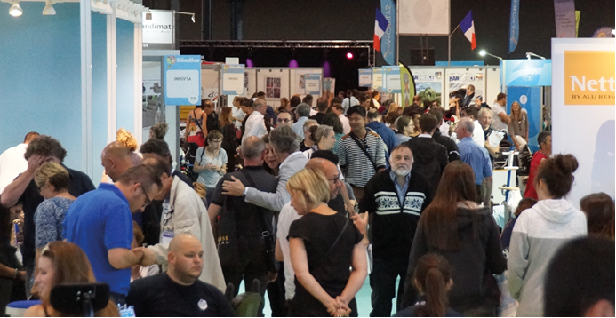

# INFORMATIONS SUR LA MOBILITÉ DES PERSONNES PORTANT UN HANDICAP
[ACCUEIL](index.md)
## INTRODUCTION  

## ESPACES POUR PORTEUR DE HANDICAP DANS LES SALONS DES NOUVELLES TECHNOLOGIES 
* [Le CES à Las Vegas](ces.md)
* **_Le salon Handica_**
    
## LES DIFFÉRENTES TECHNOLOGIES
##### 1. Les exosquelettes 
- [Informations globales](exoprésent.md)
- [Projet "BCI"](BCI.md)
  
##### 2. Les prothèses
- [Informations globales](Prothèseinfo.md)
- [Prothèses 3D](Prothèse3D.md)
- [Hugh Herr : Conférences (Anglais)](Hughvidéo.md)
  
##### 3. Les fauteuils roulants
- [Fauteuils verticalisateurs](FauteuilVertical.md)
- ["NEUROMOOV"](Neuromoov.md)
  
##### 4. La canne connectée
- ["SHERPA"](Canneconnectée.md)
  
##### 5. Véhicules pour personne à mobilité réduite
- [Voitures adaptées](Voitureadaptée.md)
- [Voiture "ELBEE"](Elbee.md)

----------------------------------------------------------
 

Le salon Handica est un marché des nouvelles technologies exposant, à Lyon, du matériel spécifique au maintient à domicile et à l'aide aux personnes âgées et/ou porteur de handicap.

 

### SALON HANDICA. Handica 2017 [en ligne]. _In accueil_ Publié le 13 juin 2017. [Consulté le 25 mai 2019]. Disponible en ligne : [https://www.youtube.com/watch?time_continue=3&v=LC8I_o1Zk4QMercredi](https://www.youtube.com/watch?time_continue=3&v=LC8I_o1Zk4Q) 

   

### SALON HANDICA. Le salon pour l’autonomie à tous les âges. [en ligne]. _In Salon Handica_. Publié le 21 février 2013. [Consulté le 25 mai 2019]. Disponible en ligne : [http://www.handica.com/handica_lyon/lyon/fr/265-handica_lyon.html](http://www.handica.com/handica_lyon/lyon/fr/265-handica_lyon.html)

